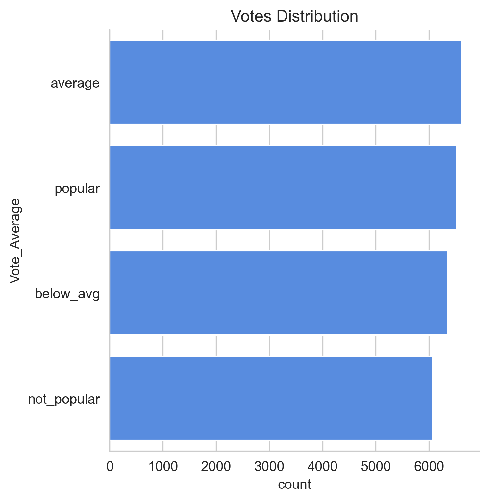
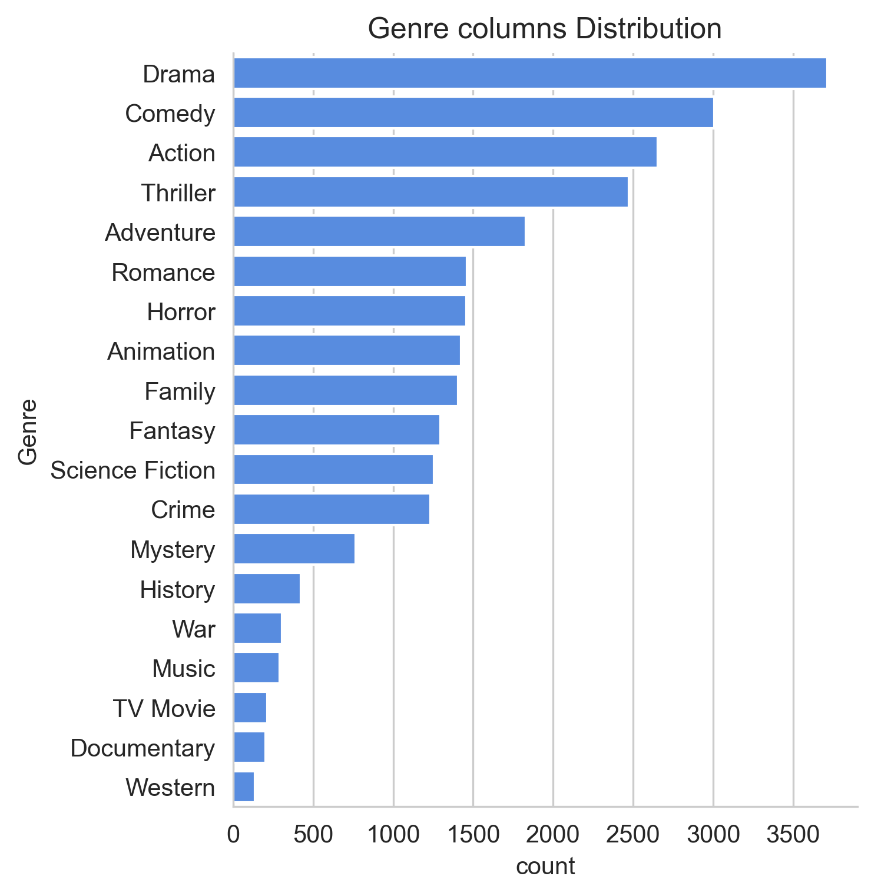
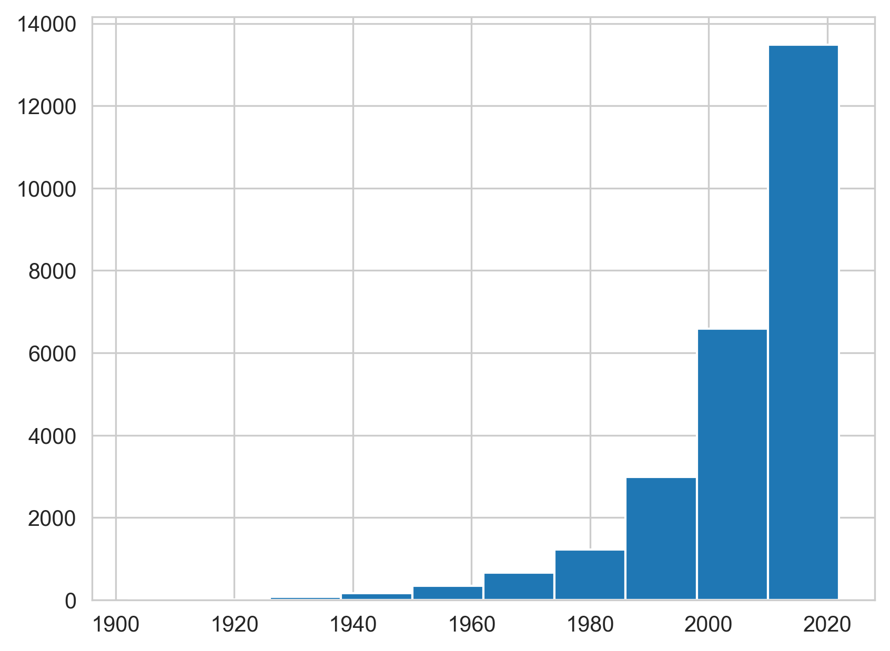

# 🎬 TMDB Movie Data Analysis

An Exploratory Data Analysis (EDA) project using the TMDB movie dataset to uncover trends in movie genres, popularity, voting patterns, and release years using Python.

---

## 📌 Project Overview

This project analyzes a dataset containing approximately **9,800 movies** from TMDB (The Movie Database). The goal is to clean the data, 
perform exploratory data analysis, visualize important patterns, and answer several analytical questions using Python.

---

## 🎯 Analysis Objectives

This project answers the following questions:

- What is the most frequent movie genre?
- Which genres receive the highest vote averages?
- Which movie has the highest popularity?
- Which movie has the lowest popularity?
- Which release year has the highest number of movies?

---

## 📊 Key Findings

| Analysis | Result |
|----------|--------|
| 🎭 Most Frequent Genre | Drama |
| ⭐ Highest Rated Genre | Drama |
| 🔥 Most Popular Movie | Spider-Man: No Way Home |
| 📉 Least Popular Movie | The United States vs. Billie Holiday / Threads |
| 📅 Year with Most Movie Releases | 2020 |

---

## 🧹 Data Preprocessing

The following preprocessing steps were performed before analysis:

- Loaded and explored the dataset
- Checked for missing values
- Checked for duplicate records
- Converted `Release_Date` to datetime format
- Extracted release year from the date column
- Removed unnecessary columns
- Categorized `Vote_Average` into four groups:
  - Not Popular
  - Below Average
  - Average
  - Popular
- Split multiple genres into individual rows using `explode()`
- Converted selected columns into categorical data types

---

## 📈 Exploratory Data Analysis

The notebook includes visualizations and analysis of:

- Genre distribution
- Vote average distribution
- Popularity analysis
- Release year trends
- Most and least popular movies
- Genre frequency comparison

---

## 🛠 Technologies Used

- Python
- Pandas
- NumPy
- Matplotlib
- Seaborn
- Jupyter Notebook

---

## 💡 Skills Demonstrated

- Data Cleaning
- Data Wrangling
- Exploratory Data Analysis (EDA)
- Feature Engineering
- Data Visualization
- Statistical Analysis
- Pandas
- NumPy
- Matplotlib
- Seaborn

---

## 📂 Project Structure

```
movie_data_analysis.ipynb/
│
├── movie_data_analysis.ipynb
├── mymoviedb.csv
├── README.md
├── requirements.txt
└── .gitignore
```

---
## 📷 Sample Visualizations

### Genre Distribution



### Popularity Distribution



### Release Year Distribution


---

## 🚀 How to Run

1. Clone this repository

```bash
git clone https://github.com/mohammad-forhad-git/movie_data_analysis.ipynb.git
```

2. Move into the project folder

```bash
cd movie_data_analysis.ipynb
```

3. Install the required libraries

```bash
pip install -r requirements.txt
```

4. Launch Jupyter Notebook

```bash
jupyter notebook
```

5. Open **movie_data_analysis.ipynb** and run all cells.

---

## 📊 Dataset

- **Source:** TMDB (The Movie Database)
- **Size:** Approximately 9,800 movie records
- **Features:** Title, Genre, Popularity, Vote Average, Vote Count, Release Date, Language, Overview, Poster URL

---

## 🔮 Future Improvements

- Build an interactive Power BI dashboard
- Create a Streamlit web application
- Predict movie popularity using Machine Learning
- Perform sentiment analysis on movie overviews

---

## 👨‍💻 Author

**Mohammad Forhad Hossen**

Software Engineering Student  
Daffodil International University

GitHub: https://github.com/mohammad-forhad-git

---

## ⭐ Support

If you found this project useful, consider giving it a ⭐ on GitHub.

Thank you for visiting this repository!
